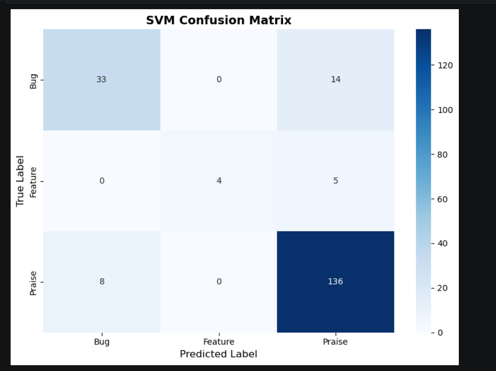
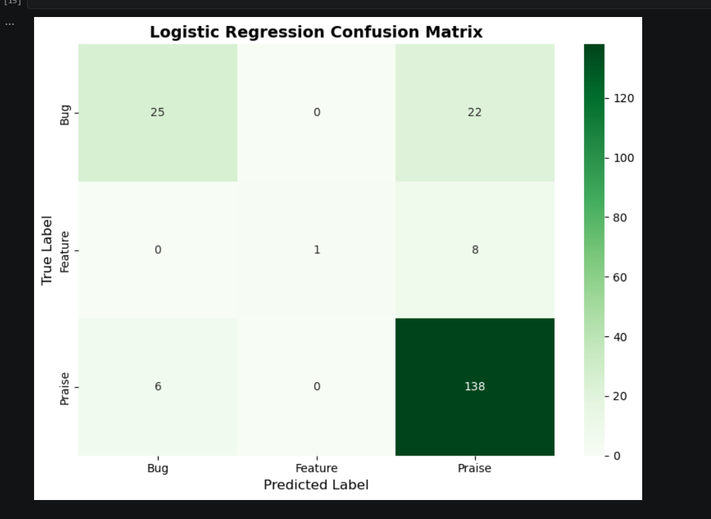
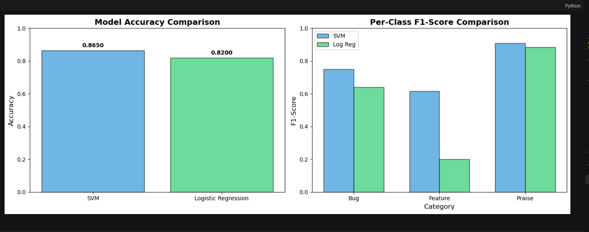

# llm-app-review-classifier
LLM-assisted NLP pipeline to classify app reviews into bugs, feature requests, and praise using Neural-Chat 7B and ML models

# App Review Classifier (LLM + Machine Learning Pipeline)

## Key Highlights
- LLM-assisted labeling using Neural-Chat 7B
- Achieved 86.5% accuracy with SVM
- Fast inference (1–5ms per review)
- Reduced manual labeling cost significantly

---

## Overview
This project classifies Google Play Store app reviews into:
- Bug Reports
- Feature Requests
- Praise

Instead of manually labeling data, a local LLM (Neural-Chat 7B) generates initial labels, which are then used to train traditional ML models.

---

## Sample Output

Input:
"This app crashes every time I open it"  
Prediction: Bug Report  

Input:
"Would love a dark mode!"  
Prediction: Feature Request  

---

## Results

- SVM Accuracy: 86.5%  
- Logistic Regression Accuracy: 82%  
- Zero confusion between bug and feature classes  
- Sarcasm detection: 42.9%

  ## Results Visualization

### SVM Confusion Matrix


### LG Confusion Matrix

### Accuracy Comparison


---

## Tech Stack

**LLM:**
- Ollama  
- Neural-Chat 7B  

**ML:**
- scikit-learn  
- TF-IDF  

---

## How to Run

1. Install Ollama:
```bash
ollama pull neural-chat
````

2. Install dependencies:

```bash
pip install -r requirements.txt
```

3. Run:
   Open `reviews.ipynb` and execute all cells

---

## Challenges

* Class imbalance (feature requests are rare)
* Sarcasm detection is difficult
* LLM inference is slow

---

## Future Improvements

* Improve feature request detection
* Use larger LLMs
* Expand dataset size
* Add confidence scoring

---

## Project Structure

```
├── reviews.ipynb
├── requirements.txt
└── README.md
```

---

## License

MIT

